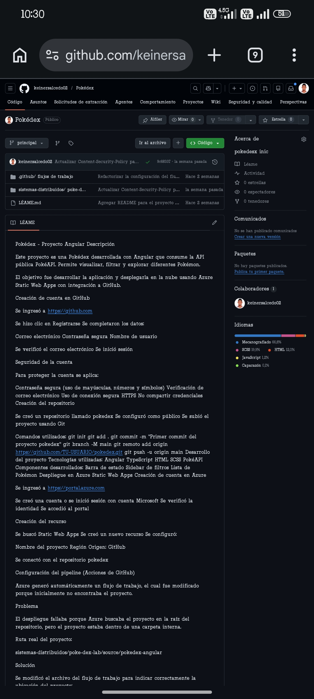
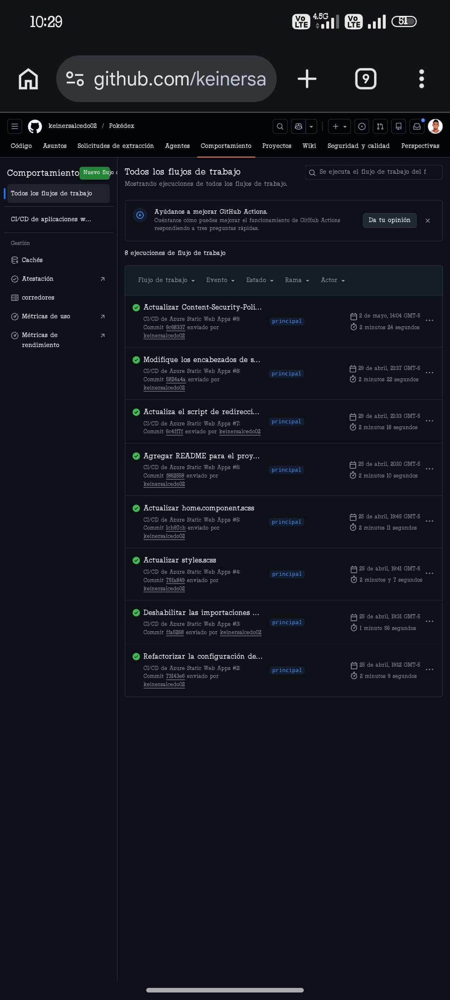
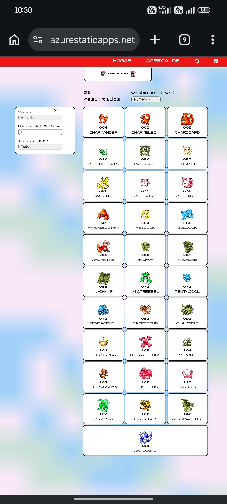
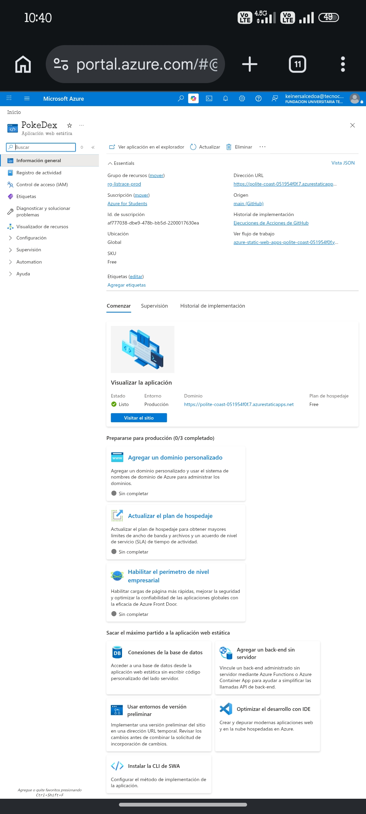
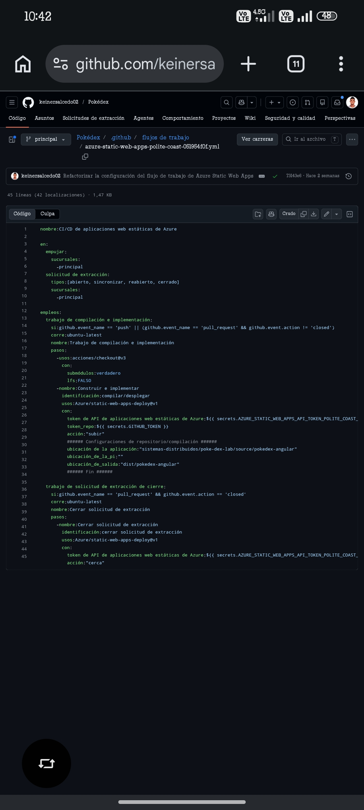
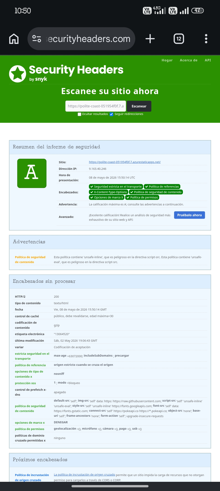

# Pokédex Angular — Sistemas Distribuidos

Aplicación web desarrollada en Angular que consume información de Pokémon usando PokéAPI.  
El proyecto fue desplegado en Azure Static Web Apps con integración continua utilizando GitHub y GitHub Actions.

---

# Información del Proyecto

## Tecnologías Utilizadas

- Angular
- TypeScript
- HTML5
- CSS3
- PokéAPI
- GitHub Actions
- Azure Static Web Apps

---

# Funcionalidades de la Aplicación

- Visualización de Pokémon
- Filtros dinámicos
- Búsqueda en tiempo real
- Navegación SPA
- Consumo de API REST
- Diseño responsive

---

# Evidencia del Repositorio

La siguiente imagen muestra el repositorio principal del proyecto en GitHub.

---

# Historial de Versiones y Commits

El proyecto cuenta con múltiples commits realizados durante el desarrollo, demostrando el avance y evolución de la aplicación.

Entre los cambios realizados se encuentran:

- Configuración del pipeline
- Corrección de rutas SPA
- Configuración de seguridad
- Optimización de estilos
- Actualización del README

---

# Desarrollo del Proyecto

## Componentes Desarrollados

- Barra de navegación
- Barra lateral de filtros
- Tarjetas de Pokémon
- Buscador dinámico
- Sistema de ordenamiento

---

# Aplicación en Funcionamiento

La siguiente evidencia muestra la aplicación ejecutándose correctamente después del despliegue.

---

# Despliegue en Azure Static Web Apps

## Creación del Recurso

La aplicación fue desplegada utilizando Azure Static Web Apps con integración directa a GitHub.

Se configuró:

- Repositorio GitHub
- Rama principal
- Pipeline CI/CD
- Variables de compilación
- Ruta del proyecto Angular

---

# Evidencia de Azure Static Web Apps

La siguiente imagen muestra el recurso creado en Azure.

---

# Configuración del flujo de trabajo de GitHub Actions

Azure generó automáticamente un flujo de trabajo para el despliegue continuo de la aplicación.

Inicialmente el despliegue fallaba porque Azure buscaba el proyecto en la raíz del repositorio.  
Posteriormente se corrigió la ruta del proyecto Angular dentro del workflow.

---

# Configuración de Seguridad

Se implementaron encabezados de seguridad HTTP para mejorar la protección de la aplicación desplegada.

Entre las configuraciones aplicadas se encuentran:

- Content Security Policy
- X-Frame-Options
- X-Content-Type-Options
- Referrer-Policy
- Permissions-Policy

---

# Conclusiones

Durante el desarrollo del proyecto se aplicaron conceptos relacionados con:

- Desarrollo SPA con Angular
- Consumo de APIs REST
- Automatización CI/CD
- Despliegue en la nube
- Configuración de seguridad web
- Administración de repositorios GitHub

El proyecto permitió fortalecer conocimientos prácticos en desarrollo frontend moderno y despliegue continuo utilizando herramientas profesionales.
